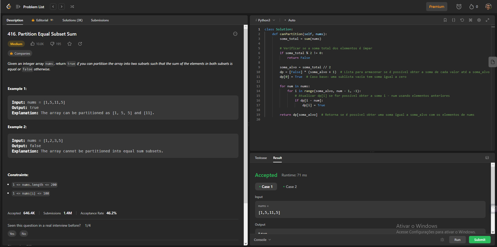
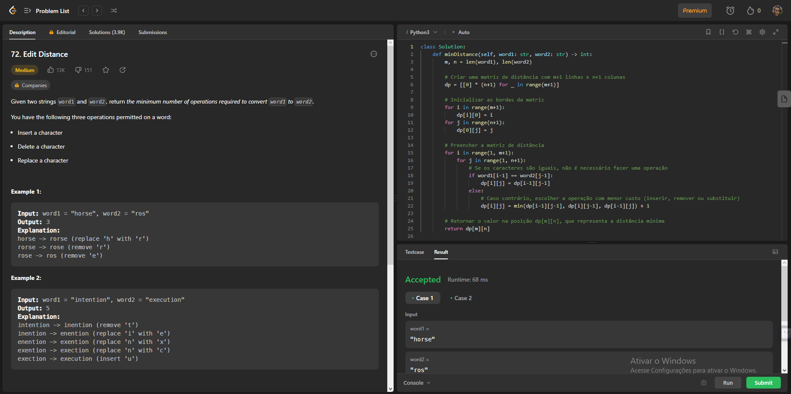
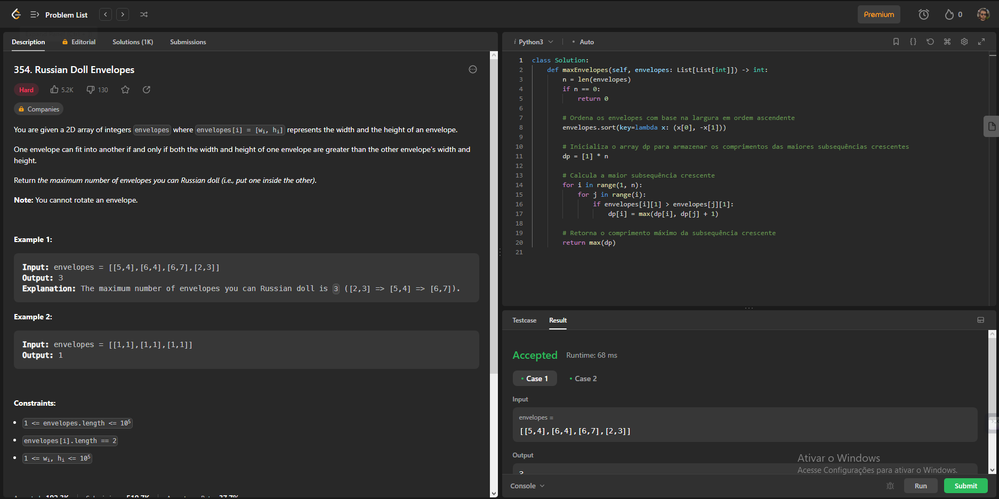
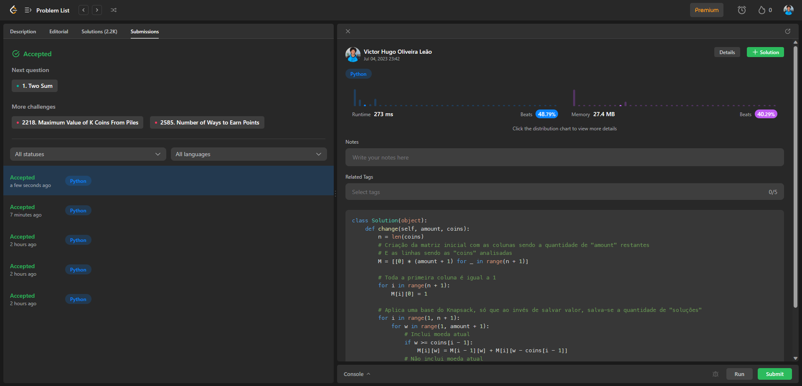
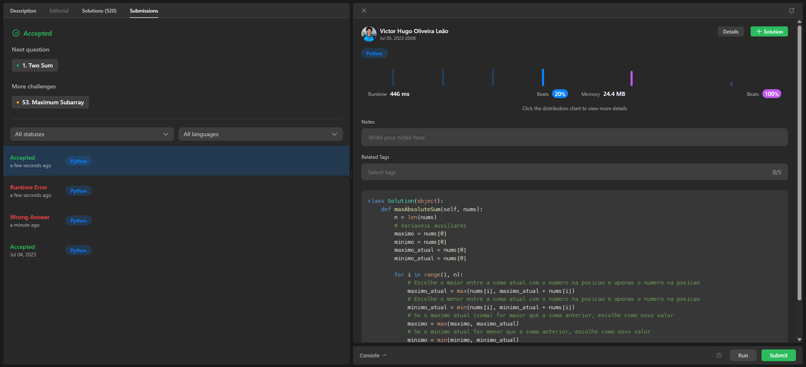
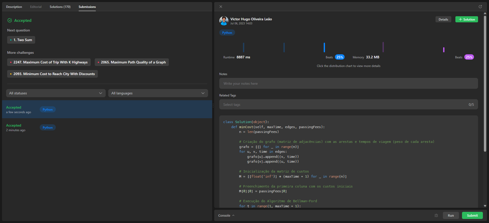

# Programação dinamica - Exercicios Diversos (Leet Code)

**Número da Lista**: 25 (turma 2) 
**Conteúdo da Disciplina**: Programação dinamica 

## Alunos
|Matrícula | Aluno |
| -- | -- |
| 20/0028472  |  Vinícius Assumpção de Araújo T01 |
| 20/0028367  |  Victor Hugo Oliveira Leão T02 |

## Sobre 
Este projeto se trata da resolução de 6 exercícios (4 médios e 2 difíceis pela classificação do site) abordando o tema de algoritimos de programação dinamica. Os exercícios foram retirados do site [LeetCode](https://leetcode.com).

## Screenshots

### Exercicio 1 (Médio) - [PartitionEqual](https://leetcode.com/problems/partition-equal-subset-sum/)
**Código:** [ACESSO](PartitionEqual/PartitionEqual.py) 

### Exercicio 2 (Médio) - [EditDistance](https://leetcode.com/problems/edit-distance/)
**Código:** [ACESSO](EditDistance/EditDistance.py) 

### Exercicio 3 (Díficil) - [RussianDoll](https://leetcode.com/problems/russian-doll-envelopes/)
**Código:** [ACESSO](RussianDoll/RussianDoll.py) 

### Exercicio 4 (Médio) - [Coin Change II](https://leetcode.com/problems/coin-change-ii/)
**Código:** [ACESSO](CoinChange/CoinChange.py) 

### Exercicio 5 (Médio) - [Maximum Absolute Sum of Any Subarray](https://leetcode.com/problems/maximum-absolute-sum-of-any-subarray/)
**Código:** [ACESSO](MaximumSumArray/MaximumSumArray.py) 

### Exercicio 6 (Díficil) - [Minimum Cost to Reach Destination in Time](https://leetcode.com/problems/minimum-cost-to-reach-destination-in-time/)
**Código:** [ACESSO](MinimumCost/MinimumCost.py) 

## Vídeo

para melhor visualização segue o link:

[Vídeo no YouTube](https://www.youtube.com/watch?v=PEr1KDCqMJA)

https://github.com/projeto-de-algoritmos/PD_ExerciciosDiversosDupla25/assets/78980842/f15b1081-3b07-4884-a1f8-3ee12b8098b9

## Instalação 
**Linguagem**: Python 
**Framework**:  

Cada problema resolvido há seu código. Assim, caso queira tentar rodar localmente, é necessário apenas o Python instalado na máquina. Para testar no próprio LeetCode, basta ter uma conta e rodar o código no terminal do serviço.

## Uso 

### Passo 1: Copiar o código
Entre na pasta do exercício específico, clique no arquivo `.py` do código de interesse e copie-o.

### Passo 2: Entrar na página do exercício
Entre na página LeetCode do exercício específico para que o código seja executado. O link para a página pode ser encontrado neste README na sessão "Sobre".

### Passo 3: Alterar linguagem
Altere a linguagem utilizada como resolução para `Python3` (a opção fica logo acima do editor de código).

### Passo 4: Colar o código
Ainda na página do LeetCode, cole o código copiado no editor de código.

### Passo 5: Rodar o código
Abaixo do editor de código, clique em `Run` para executar o código.

### Passo 6: Verificar resultados
Assim que executado, verifique os resultados e se o código resolve o exercício.

## Outros

A dupla dividiu 3 exercícios para cada. Assim, os 3 primeiros exercícios foram resolvidos pelo integrante Vinícius e os últimos 3 foram resolvidos pelo integrante Victor.
